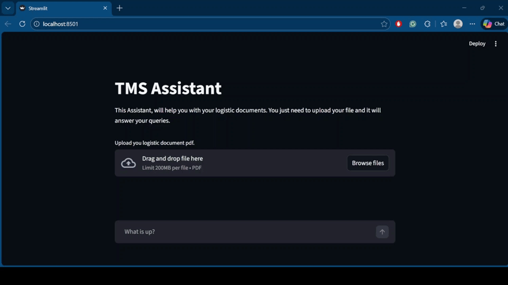

# TMS-Assistant

AI assistant for the Transportation Management System (TMS).  
This project leverages LLMs and custom pipelines to assist users and developers in interacting efficiently with the TMS through natural language.

<p align="center">
  
</p>

---

## 📌 Features

✅ Natural language assistant for TMS queries  
✅ Filters context which is not relevant to the user query<br>
✅ Converts PDF to text using ```docling```, converts the extracted text into chunks using ```token-based``` chunking, and adds it to the ```Qdrant VectorDB```<br>
✅ Filters context which doesn't cloesely aligns with the user query using a threshold of 0.6. <br>


---

## 📁 Repository Structure

| File / Folder | Description |
|---------------|-------------|
| `app.py` | Streamlit application entrypoint — runs the assistant service using Streamlit |
| `main.py` | A FastAPI app that contains the endpoints: ```\upload```, ```\ask```, ```\extract``` |
| `agent.py` | A simple agent to answer the user query using the relevant context |
| `cfg.py` | Configuration file for environment variablesAPI keys |
| `data_pipeline.py` | Pipeline to preprocess, ingest data to the VectorDB |
| `llm_stack.py` | Defines the LLM client, embedding model and VectorDB functions.|
| `requirements.txt` | Lists all Python dependencies needed to run the project |
| `data` | Folder containing sample TMS pdf for testing |

---

## Sample response from ```/extract``` endpoint
```json
{
  "response": {
    "company_details": {
      "address": "9245 Laguna Springs Dr., Suite#200, Elk Grove, CA, 95758-7991",
      "mailing_address": {
        "street": "1250 Broadway",
        "city": "New York",
        "state": "New York",
        "zip_code": "10001"
      },
      "phone": "(844) 850-3391",
      "fax": "916-209-6669",
      "after_hours_contact": "usdev@ultraship.ai"
    },
    "carrier_details": [
      {
        "carrier": "SWIFT SHIFT LOGISTICS LLC",
        "carrier_mc": "MC1685682",
        "phone": "(618) 629-3271",
        "equipment": "Flatbed",
        "agreed_amount_usd": 400,
        "size_in_feet": 48
      }
    ],
    "stops": [
      {
        "stop_number": 1,
        "type": "Pickup",
        "location": "AAA Los Angeles International Airport (LAX), World Way, Los Angeles, CA, USA",
        "po_container_no": "112233ABC",
        "load_type": "FTL",
        "shipping_date": "02-08-2026",
        "shipping_time": "09:00 - 17:00",
        "appointment": "15:00",
        "commodity": "Ceramic",
        "weight": "56000.00 lbs",
        "quantity": "10000 units",
        "description": "Pickup from the shipper location during normal operating hours. Driver to follow on-site instructions at arrival"
      },
      {
        "stop_number": 2,
        "type": "Drop",
        "location": "7470 Cherry Avenue, Fontana, CA 92336",
        "po_container_no": "5678abcd",
        "load_type": "FTL",
        "delivery_date": "02-08-2026",
        "delivery_time": "09:00 - 17:00",
        "appointment": "-",
        "commodity": "Ceramic",
        "weight": "56000.00 lbs",
        "quantity": "10000 units",
        "description": "Delivery to the consignee location as scheduled. Driver to follow standard receiving procedures."
      }
    ],
    "rate_breakdown": {
      "carrier_pay": {
        "flatbed": "$ 400.00 USD"
      },
      "total": "400.00 USD"
    },
    "dispatch_details": {
      "dispatcher": "Zukhruf Rukha",
      "reference_id": "LD53657",
      "phone": "+919884954552",
      "created_on": "02-07-2026 02:27",
      "shipping_date": "02-08-2026",
      "booking_date": "02-07-2026",
      "email": "zukhruf.rukha@ultraship.ai"
    },
    "standing_instructions": [],
    "special_instructions": "All shipments must be palletized and shrink-wrapped. Drivers should check in at the warehouse and follow site safety rule s. No weekend pickups/deliveries unless pre-approved. For reefer loads, ensure units are pre-cooled to the specified tem perature.",
    "shipper_carrier_instructions": {
      "shipper_instructions": "All shipments must be palletized and shrink-wrapped. Drivers should check in at the warehouse and follow site safety rules.",
      "carrier_instructions": "No weekend pickups/deliveries unless pre-approved. For reefer loads, ensure units are pre-cooled to the specified temperature."
    },
    "test_rc_instructions": "This is a placeholder for RC instructions. Please review the required steps, verify all details, and proceed accordingly. If any issues are identified, document them and report to the relevant team. These instructions are for demo purposes only.",
    "driver_details": [
      {
        "driver_name": "John Doe",
        "cell_no": "+1 234 567 8900",
        "truck_no": 123456,
        "trailer_no": 987654
      }
    ],
    "acceptance": {
      "accepted_by": null,
      "date": null,
      "signature": null
    }
  }
}
```
---

## 🚀 Environment Setup

To get started locally, follow these steps:

### 🧠 Prerequisites

✔ Python 3.10 or above  
✔ `git` installed on your machine  

### 🛠️ Clone & Install

```bash
git clone https://github.com/mohan-gupta/TMS-Assistant.git
cd TMS-Assistant
```

### Create Python Environment
```bash
uv venv --python 3.12
```

### Activate the Python Environment
```bash
.venv\Scripts\activate # for windows

source .venv/bin/activate # for mac and linux
```
### Install the dependencies
```bash
uv pip install -r requirements.txt
```
### Create the .env file
```
GEMINI_API_KEY=<your api key>
QDRANT_API_KEY=<qdrant api key>
QDRANT_CLUSTER_URL=<cluster url>
```
### Finally run the app
```bash
streamlit run main.py
```

### To start the server
```bash
uvicorn main:app
```